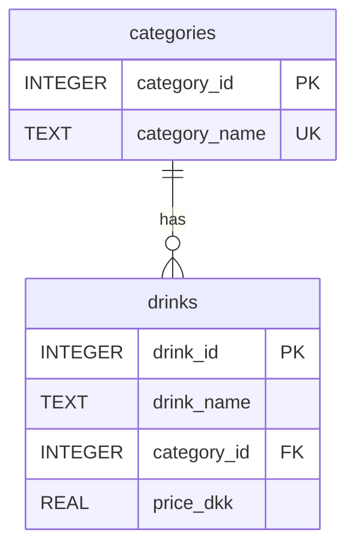

# Drink Service


## Overview

The Drink Service is a component of the Hotel Kong Arthur management system, responsible for handling all beverage-related operations. Built with Flask and SQLite, this microservice provides a RESTful API for managing the hotel's drink menu and pricing.

**Key Features:**
- Retrieve all drinks with their categories
- Get specific drink details by ID
- Category-based drink organization
- Comprehensive error handling
- Docker containerization
- Modular Flask architecture

## Project Structure

```bash
DrinkService/
├── api/
│   └── drink_routes.py              # API endpoints implementation
├── database/
│   ├── connection.py                # Database connection handler
│   ├── initialize.py                # Database setup and initialization
│   └── drinks_menu.db               # SQLite database
├── xlxs/
│   └── drinks_menu_with_sales.xlsx  # Initial data source
├── repositories/
│   └── drink_repository.py          # Data access layer
├── app.py                           # Main application entry point
├── Dockerfile                       # Docker configuration
├── requirements.txt                 # Python dependencies
└── README.md                        # Project documentation
```

## Database Schema



## API Documentation

| Method | Endpoint | Description | Request Body | Response (200) | Error Responses |
|--------|----------|-------------|--------------|----------------|-----------------|
| GET | `/api/v1/drinks` | Get all drinks | N/A | `[{"drink_id": 1, "drink_name": "Mojito", "category": "cocktail", "price_dkk": 120.00}]` | 404: `{"error": "No drinks found"}` |
| GET | `/api/v1/drinks/{id}` | Get drink by ID | N/A | `{"drink_id": 1, "drink_name": "Mojito", "category_id": 1, "price_dkk": 120.00}` | 404: `{"error": "Drink not found"}` |

## Installation & Setup

### Local Development

```bash
# Create and activate virtual environment
python3 -m venv .venv
source .venv/bin/activate

# Install dependencies
pip install -r requirements.txt

# Run the application
python3 app.py
```

### Docker Setup

1. Create Docker network (if not exists):
```bash
docker network create microservice-network
```

2. Build and run the service:
```bash
# Build image
docker build -t drink_service . && docker image prune -f

# Run container
docker run -d \
  -p 5004:5004 \
  --name drink_service \
  --network microservice-network \
  drink_service
```

## Testing

### Prerequisites
- Docker Desktop installed and running
- Python 3.x (for local development)
- Postman or similar API testing tool

### Example API Calls

1. **Get all drinks**
   - **Method:** GET
   - **Request:** `http://127.0.0.1:5004/api/v1/drinks`
   - **Response Example:**
```json
[
    {
        "drink_id": 1,
        "drink_name": "Mojito",
        "category": "cocktail",
        "price_dkk": 120.00
    },
    {
        "drink_id": 2,
        "drink_name": "Espresso",
        "category": "coffee",
        "price_dkk": 35.00
    }
]
```

2. **Get drink by ID**
   - **Method:** GET
   - **Request:** `http://127.0.0.1:5004/api/v1/drinks/1`
   - **Response Example:**
```json
{
    "drink_id": 1,
    "drink_name": "Mojito",
    "category_id": 1,
    "price_dkk": 120.00
}
```

---

#### Created by Hotel Kong Arthur Team
